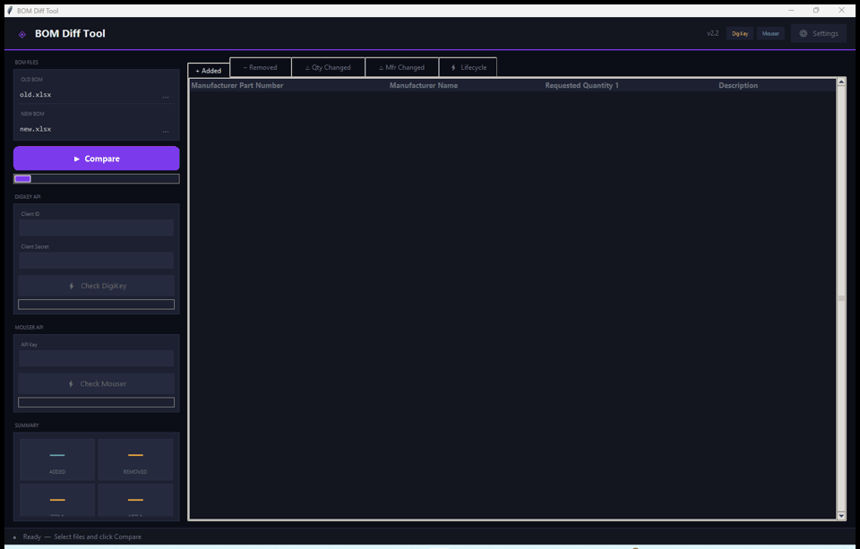
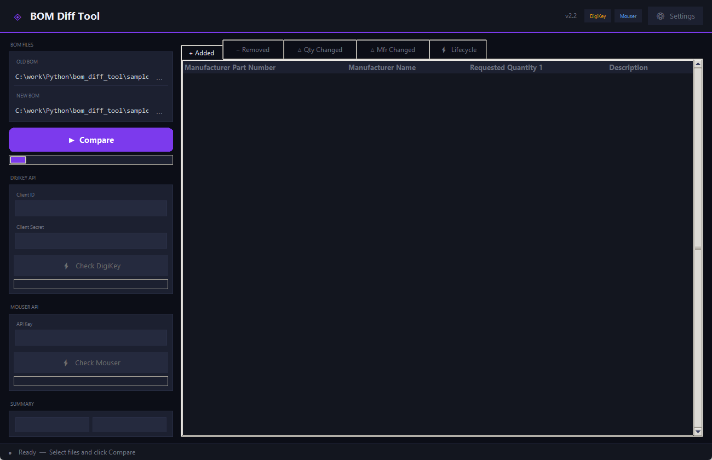
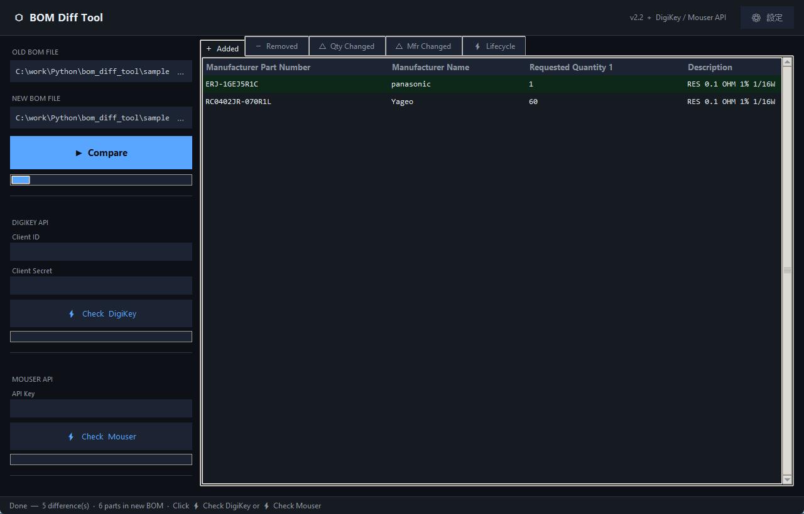

# BOM Diff Tool

BOM（部品表）を比較して差分を検出する Python 製デスクトップツールです。  
**DigiKey API** / **Mouser API** を使ったライフサイクルチェック（廃品・NRND 検出）にも対応しています。

**[English README is here → README.md](README.md)**

```
┌──────────────────────────────────────────────────────────────┐
│  ⬡  BOM Diff Tool          v2.2  +  DigiKey / Mouser API   │
├───────────────┬──────────────────────────────────────────────┤
│ OLD BOM FILE  │  ┌─ タブ ─────────────────────────────────┐ │
│ [old.xlsx  ]… │  │ ＋Added │－Removed │△Qty │△Mfr │⚡Life │ │
│               │  ├─────────────────────────────────────────┤ │
│ NEW BOM FILE  │  │ Part Number  │ Mfr Name │ Qty  │  ...   │ │
│ [new.xlsx  ]… │  │ GRM188R61... │ Murata   │ 100  │  ...   │ │
│               │  └─────────────────────────────────────────┘ │
│ ▶ Compare    │                                               │
│ ─────────────│  ⚡ Lifecycle タブ                             │
│ DIGIKEY API  │  ┌─────────────────────────────────────────┐ │
│ Client ID    │  │ Part Number  │ Status    │ ...           │ │
│ [••••••••••] │  │ GRM188R61... │ Obsolete  │ ...           │ │
│ Client Secret│  │ LQW18AN10... │ Active    │ ...           │ │
│ [••••••••••] │  │ RC0402JR-... │ Not Found │ ...           │ │
│⚡ Check DK   │  └─────────────────────────────────────────┘ │
│ ─────────────│  SUBSTITUTES  (DigiKey / Mouser)              │
│ MOUSER API   │  ┌─────────────────────────────────────────┐ │
│ API Key      │  │ Mfr Part No │ DK/Mouser P/N │ Source    │ │
│ [••••••••••] │  └─────────────────────────────────────────┘ │
│⚡ Check MS   │                                               │
│ ─────────────│                                     ⚙ 設定   │
│ SUMMARY      │                                               │
│ Added    [ 1]│                                               │
│ Removed  [ 1]│                                               │
│ Qty Δ    [ 1]│                                               │
│ Mfr Δ    [ 1]│                                               │
│ Obsolete [ 2]│                                               │
│ NRND     [ 1]│                                               │
│↓ Save Report │                                               │
└───────────────┴──────────────────────────────────────────────┘
```

---

## デモ

BOM ファイルを選んで **▶ Compare** をクリックするだけで、差分が即座に表示されます。



| ステップ | 内容 |
|---|---|
| **① ファイル選択** | **…** ボタンで `old.xlsx` と `new.xlsx` を指定 |
| **② ▶ Compare** | 差分を自動検出してカテゴリ別に分類 |
| **③ 結果表示** | 追加 / 削除 / Qty変更 / Mfr変更 がタブ別に色分けで表示 |

---

## スクリーンショット

**① ファイルを選択 — ファイルパスとカラム名が自動で認識される**



**② ▶ Compare をクリック — Added タブに追加部品が緑色で表示される**



> ウィンドウ下部のステータスバーに差分件数・新BOMの部品数が表示されます。  
> **⚡ Check DigiKey** または **⚡ Check Mouser** ボタンで新規部品のライフサイクルチェックができます。

**③ Excel レポート（bom_diff_report.xlsx）が差分シート別に保存される**


---

## 機能一覧

| 機能 | 説明 |
|---|---|
| BOM 差分比較 | 追加・削除・Quantity変更・Manufacturer変更を自動検出 |
| カラム名カスタマイズ | ⚙ 設定から任意のカラム名に変更可能（config.ini に保存） |
| DigiKey ライフサイクル | DigiKey API で Active / NRND / Obsolete を色分け表示 |
| Mouser ライフサイクル | Mouser API で Active / NRND / Obsolete を色分け表示 |
| 代替品表示 | DigiKey Substitutions / Mouser SuggestedReplacement をSource付きで表示 |
| Excel レポート出力 | 差分・ライフサイクル結果をシート別に出力 |
| Prepare ツール | 任意Excelから不要列を削除して old/new.xlsx として保存 |
| CLI モード | `--cli` オプションで GUI なし実行可能 |

---

## 必要環境

- Python 3.11 以上
- Windows / macOS / Linux（tkinter が使える環境）

---

## インストール

```bash
# 1. リポジトリをクローン
git clone https://github.com/your-username/bom-diff-tool.git
cd bom-diff-tool

# 2. 依存パッケージをインストール
pip install -r requirements.txt

# 3. 設定ファイルを作成
cp config.ini.example config.ini
# config.ini をエディタで開いて APIキーを設定
```

---

## 使い方

### BOM 比較ツール（メイン）

```bash
python main.py          # GUI モード（デフォルト）
python main.py --cli    # CLI モード
```

**GUI の操作フロー：**

1. **…** ボタンで OLD / NEW の Excel ファイルを選択（パスを直接入力することも可能）
2. **▶ Compare** をクリックして差分を確認
3. ライフサイクルチェックを行う場合は、認証情報を入力して以下のいずれかをクリック：
   - **⚡ Check DigiKey** — DigiKey API を使用（Client ID + Client Secret が必要）
   - **⚡ Check Mouser** — Mouser Search API を使用（API Key が必要）
4. **↓ Save Excel Report** でレポートを保存

### Prepare ツール（前処理）

```bash
python prepare.py
```

Excel ファイルから不要な列を削除して `old.xlsx` / `new.xlsx` として保存します。  
**⚙ 設定** から使用するカラム名を変更すると、設定した4列が自動的にチェックONになります。

### CLI モード

```bash
python main.py --cli --old old.xlsx --new new.xlsx --output report.xlsx
```

---

## カラム名のカスタマイズ

デフォルトのカラム名は以下の通りです。

| 論理名 | デフォルト |
|---|---|
| Part Number（キー列） | `Manufacturer Part Number` |
| Manufacturer | `Manufacturer Name` |
| Quantity | `Requested Quantity 1` |
| Description | `Description` |

**変更方法：** GUI の ⚙ 設定 ボタン → カラム名を入力 → 保存  
設定は `config.ini` に自動保存され、次回起動時も維持されます。

> **注意：** カラム名は Excel ファイルのヘッダーと完全一致させてください。  
> **Prepare ツール**を使って4列だけ残してから比較することを推奨します。

---

## DigiKey API の設定

1. [DigiKey Developer Portal](https://developer.digikey.com/) でアカウントを作成
2. アプリを登録して **Client ID** と **Client Secret** を取得
3. `config.ini` に設定（または環境変数を使用）

```ini
[digikey]
client_id     = YOUR_CLIENT_ID_HERE
client_secret = YOUR_CLIENT_SECRET_HERE
```

**環境変数での設定（推奨）：**

```bash
# Windows
set DIGIKEY_CLIENT_ID=your_client_id
set DIGIKEY_CLIENT_SECRET=your_client_secret

# Mac / Linux
export DIGIKEY_CLIENT_ID=your_client_id
export DIGIKEY_CLIENT_SECRET=your_client_secret
```

---

## Mouser API の設定

1. [Mouser API Hub](https://www.mouser.com/api-hub/) でアカウントを作成
2. Developer Portal から **API Key** を発行
3. `config.ini` に設定（または環境変数を使用）

```ini
[mouser]
api_key = YOUR_MOUSER_API_KEY_HERE
```

**環境変数での設定（推奨）：**

```bash
# Windows
set MOUSER_API_KEY=your_api_key

# Mac / Linux
export MOUSER_API_KEY=your_api_key
```

> **レート制限：** 30 リクエスト/分、1,000 リクエスト/日

---

## ライフサイクルステータスの色

| 色 | ステータス | 意味 |
|---|---|---|
| 🔴 赤 | Obsolete | 廃品（製造中止） |
| 🟠 橙 | NRND | 新規設計非推奨 |
| 🟢 緑 | Active | 現行品 |
| ⬛ グレー | Not Found | API データベースに未登録 |

---

## サンプルデータ

`sample_old.xlsx` と `sample_new.xlsx` に動作確認用のダミーデータが含まれています。

GUI の **…** ボタンで直接選択するか、以下のようにコピーして使用してください。

```bash
# macOS / Linux
cp sample_old.xlsx old.xlsx
cp sample_new.xlsx new.xlsx

# Windows
copy sample_old.xlsx old.xlsx
copy sample_new.xlsx new.xlsx
```

その後 `python main.py` を実行して **▶ Compare** をクリックしてください。

サンプルデータに含まれる変更点：

| 変更種別 | 部品 |
|---|---|
| 追加 | ERJ-1GEJ5R1C |
| 追加 | RC0402JR-070R1L |
| 削除 | MMBT3904LT1G |
| Quantity 変更 | LQW18AN10NG00D（50 → 80） |
| Manufacturer 変更 | ERJ-2RKF1001X（Panasonic → Yageo） |

---

## プロジェクト構成

```
bom-diff-tool/
├── main.py                  # エントリーポイント（BOM比較ツール）
├── prepare.py               # 前処理ツール
├── requirements.txt         # 依存パッケージ
├── config.ini.example       # 設定ファイルのテンプレート
├── sample_old.xlsx          # サンプルデータ（旧BOM）
├── sample_new.xlsx          # サンプルデータ（新BOM）
├── README.md                # 英語版 README（標準）
├── README_JP.md             # このファイル（日本語）
├── LICENSE                  # MIT License
├── CHANGELOG.md             # 変更履歴
├── src/
│   ├── column_config.py     # カラム名設定の読み書き
│   ├── comparator.py        # BOM比較ロジック
│   ├── digikey_client.py    # DigiKey API クライアント
│   ├── mouser_client.py     # Mouser API クライアント
│   ├── gui.py               # メインGUI
│   ├── loader.py            # Excel読み込み
│   ├── preprocessor.py      # 前処理ロジック
│   ├── report.py            # Excelレポート出力
│   └── settings_dialog.py   # カラム名設定ダイアログ
├── tests/
│   └── test_all.py          # 自動テスト（pytest）
└── .github/
    └── workflows/
        └── test.yml         # GitHub Actions 自動テスト
```

---

## テストの実行

```bash
pip install pytest
pytest tests/ -v
```

---

## ライセンス

[MIT License](LICENSE)
